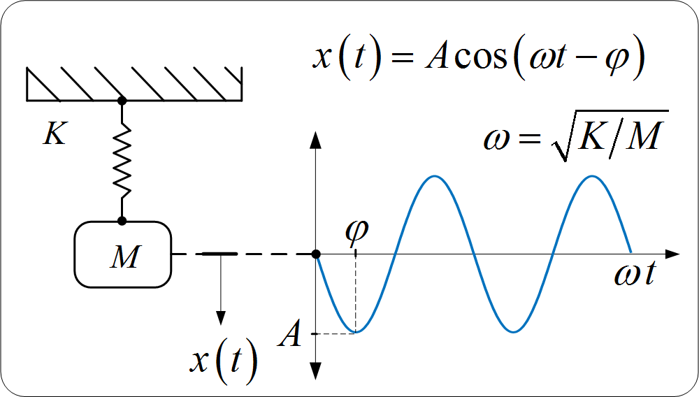

# Harmonic Oscillator

## Problem Statement
The harmonic oscillator is a classic problem in mechanics. It describes the movement of a mechanical oscillator (eg spring pendulum) **without** the influence of a restoring force and friction (undamped oscillator). This repo is meant to retrieve the solution of the harmonic oscillator differential equation exploiting the Deep Learning techniques.

## Problem Overview
The example problem we solve here is the 1D (undamped) harmonic oscillator:
$$m \dfrac{d^2 x}{dt}  = - k x,$$
with the initial condition:
$$x(0) = 1$$
This differential equation has this solution:
$$x(t) = A \cos (\omega t + \phi)$$
where
$$\omega = \sqrt{\dfrac{k}{m}}$$
Hence the motion is periodic following a sinusoidal function of amplitude $A$ and period $T = 2 \pi / \omega$
